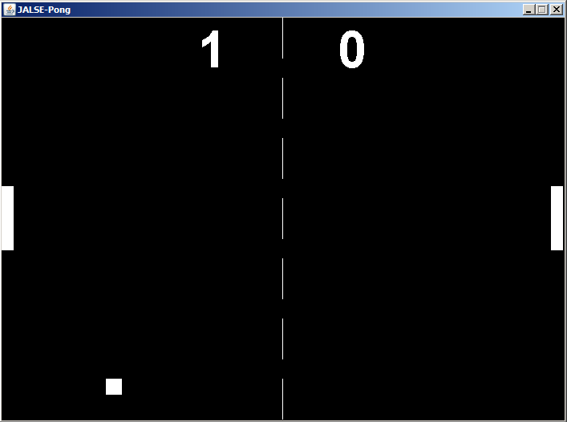

## Pong
Pong is a [JALSE](https://github.com/Ellzord/JALSE) example project. This is a very simple 2 player Pong implementation using Swing.

### Controls
Key | Action
------------- | -------------
W | Moves left paddle up
S | Moves left paddle down
UP | Moves right paddle up
DOWN | Moves right paddle down
P | Pauses the game
SPACE | Resets the game

### Screenshot

### More
See the [Wiki](https://github.com/Ellzord/JALSE/wiki) for more information.
